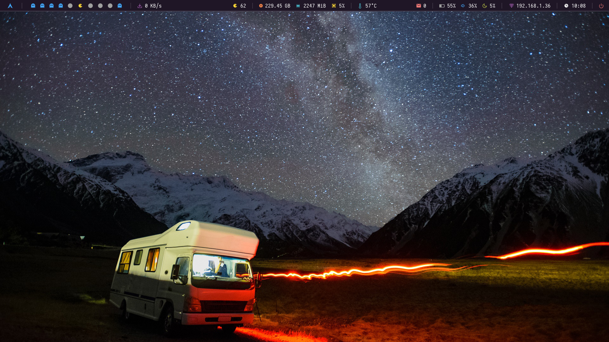
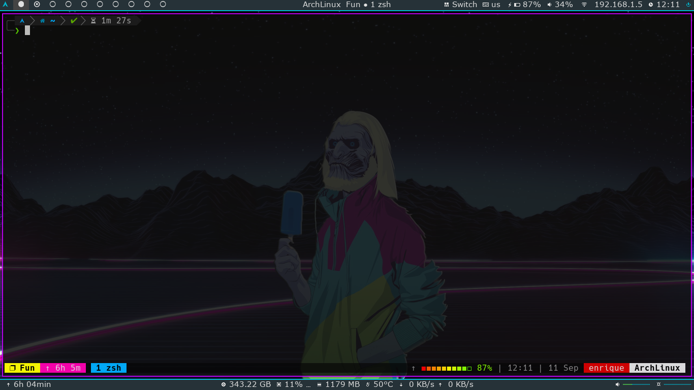
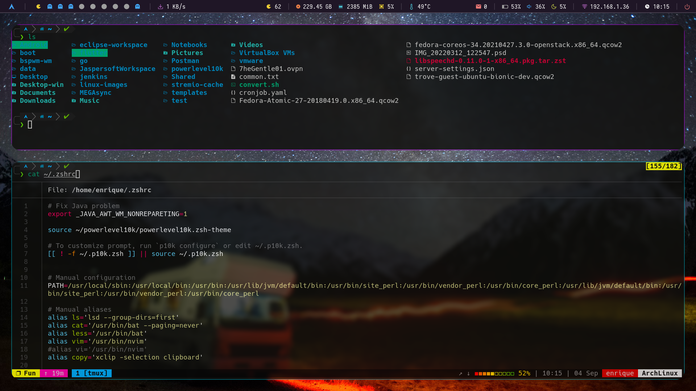
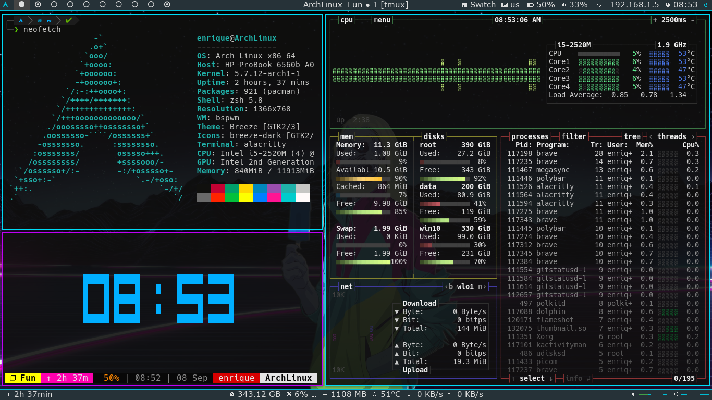
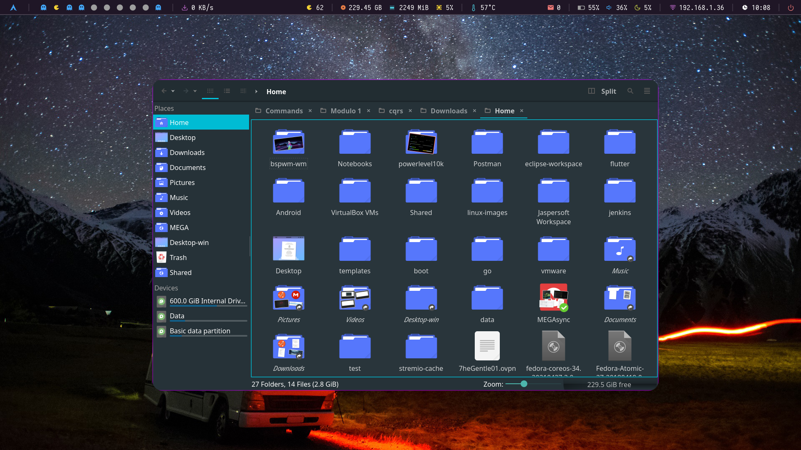
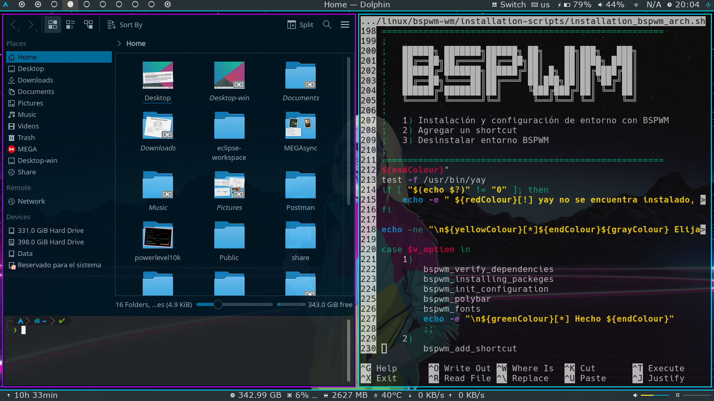
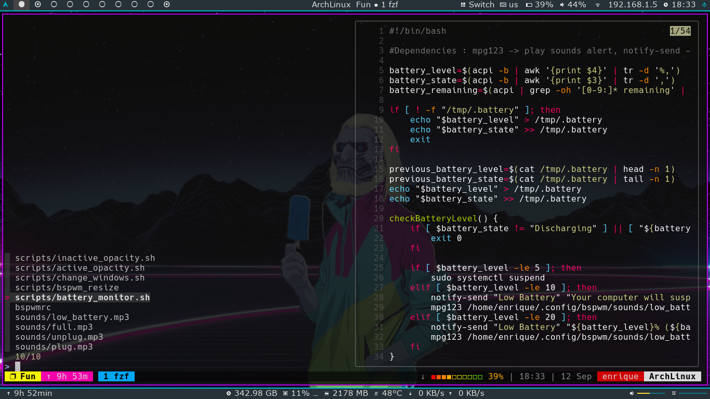
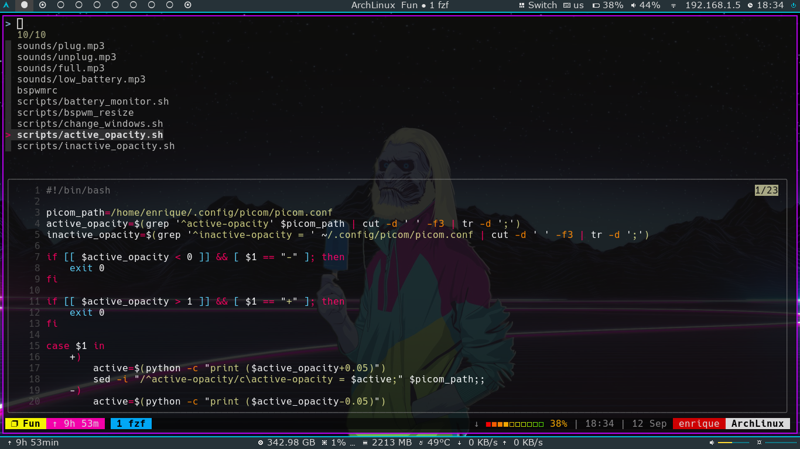
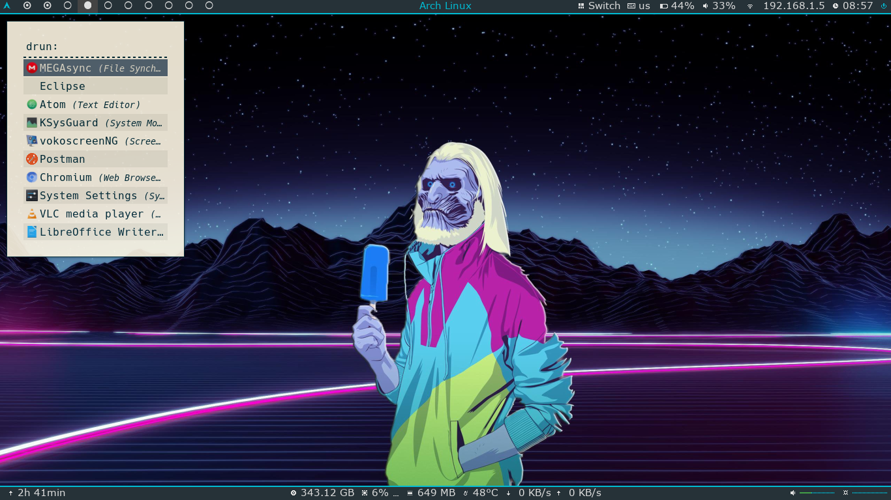
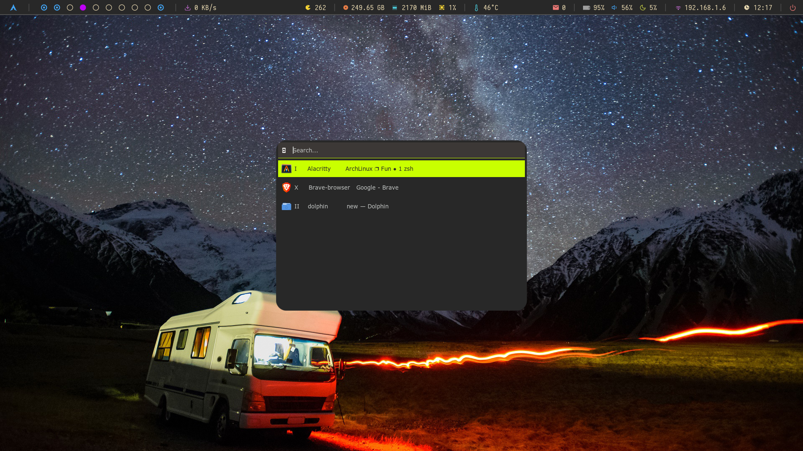

# bspwm-wm

**Hi**

**Alacritty, zsh & tmux**

**ls & cat commands**

**neofetch & bashtop**

**Dolphin**

**Dolphin & nano**

**fuzzy finder**

**rofi application finder**

**rofi open windows**

